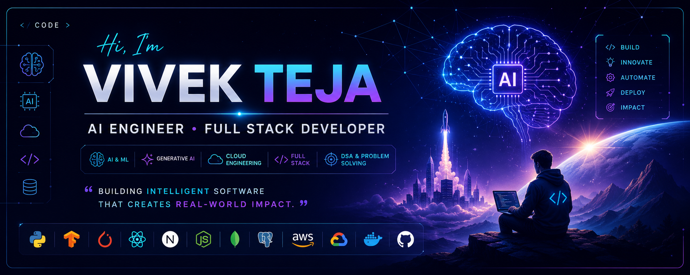

# 👋 Hi, I'm Vivek Teja

 

---

  

# 🚀 Engineering Intelligent Software for the Future

I build AI-powered applications, scalable full-stack systems, and cloud-native solutions that solve real-world problems.

Currently focused on:

  🧠 Artificial Intelligence.  
  🤖 Generative AI & LLMs.  
  🌐 Full Stack Development.  
  ☁️ Cloud Engineering.  
  ⚡ High-Performance DSA.  

## 💫 About Me

I'm **Vivek Teja**, an AI-focused Full Stack Developer passionate about creating intelligent software that solves real-world challenges. I enjoy combining modern web technologies, cloud platforms, and Generative AI to build scalable, user-centric applications.

Currently, I'm focused on developing AI-driven products, mastering advanced Data Structures & Algorithms, and exploring the next generation of Large Language Models, AI Agents, and cloud-native architectures.

### 🚀 What I'm Building

- 🧠 **MindMate** — AI-powered mood companion with personalized emotional support and insights.
- 🤖 **NEXA** — Autonomous multi-agent AI platform for collaborative reasoning and intelligent decision-making.
- ☀️ **Solar Flare Forecasting** — Deep learning research using Aditya-L1 X-ray data for early solar activity prediction.
- ⚡ **DSA Optimization Lab** — High-performance algorithm implementations and competitive programming solutions.

### 🌱 Currently Learning

- Large Language Models (LLMs)
- AI Agents & Multi-Agent Systems
- Retrieval-Augmented Generation (RAG)
- MLOps & Production AI
- Kubernetes & Cloud Computing

### 🤝 Open to Collaborate On

- Artificial Intelligence
- Generative AI
- Full Stack Applications
- Open Source Projects
- Research & Innovation
- Hackathons

> *"Building intelligent software that creates real-world impact."*

# 🚀 Featured Projects

<table>
<tr>

<td width="50%">

## 🧠 MindMate

An AI-powered mood companion that provides intelligent emotional support, personalized insights, and an engaging user experience through modern AI technologies.

**Highlights**

- 🤖 AI-powered conversations
- 📊 Mood analytics
- 🔒 Secure authentication
- ☁️ Cloud deployment
- 📱 Responsive UI

</td>

<td width="50%">

## 🤖 NEXA

A next-generation autonomous multi-agent AI system where specialized AI agents collaborate to solve complex problems and assist in intelligent decision-making.

**Highlights**

- 🧩 Multi-Agent Architecture
- 🧠 LLM Integration
- ⚡ Intelligent Task Planning
- 🌐 Full Stack
- 🚀 Scalable Design

</td>

</tr>

<tr>

<td width="50%">

## ☀️ Solar Flare Forecasting

An AI research project that predicts solar flare activity using Aditya-L1 X-ray observations and deep learning models for space-weather forecasting.

**Highlights**

- 🌞 Space AI
- 📈 Time-Series Forecasting
- 🛰️ Aditya-L1 Data
- 🧠 Deep Learning
- 🔬 Research Focus

</td>

<td width="50%">

## ⚡ DSA Optimization Lab

A collection of optimized Data Structures & Algorithms implementations emphasizing clean code, performance, and competitive programming techniques.

**Highlights**

- 💯 Efficient Algorithms
- ⚙️ Optimization
- 📚 Problem Solving
- 🏆 Competitive Programming
- 🚀 Best Practices

</td>

</tr>
</table>

# 💻 Tech Stack

### 🤖 AI & Machine Learning

### 🌐 Frontend

### ⚙️ Backend

### 🗄️ Databases

### ☁️ Cloud & DevOps

### 🛠️ Tools

# 🏅 Certifications & Achievements

### 🎓 Professional Certifications

- 🟢 Google Cloud & AI Certifications
- 🔵 Microsoft AI & Cloud Certifications
- 🟣 TCS iON Career Edge Certifications
- 🟡 NASSCOM FutureSkills Prime Certifications *(In Progress)*
- ⚪ Continuously expanding expertise through industry-recognized learning.

### 🏆 Highlights

- 🚀 Building AI-powered applications with real-world impact.
- 🤖 Exploring Generative AI, LLMs, and Multi-Agent Systems.
- ☀️ Researching AI solutions for Space Weather Forecasting.
- ⚡ Strong focus on scalable software engineering and algorithm optimization.
- 🌍 Active participant in hackathons, technical events, and open-source initiatives.

# 📊 GitHub Analytics

---

# 🏆 GitHub Trophies

## My Contribution Graph
<picture>
  <source media="(prefers-color-scheme: dark)" srcset="https://raw.githubusercontent.com/vivekteja0308-007/vivekteja0308-007/output/pacman-contribution-graph-dark.svg">
  <source media="(prefers-color-scheme: light)" srcset="https://raw.githubusercontent.com/vivekteja0308-007/vivekteja0308-007/output/pacman-contribution-graph.svg">
  
</picture>

---

# 🐍 Contribution Snake

# 📈 Contribution Graph

  

# 📊 Profile Summary

  

# 🗺️ 2026 Roadmap

<table>
<tr>
<td width="50%">

### 🚀 Current Mission

- 🧠 Build production-ready AI applications
- 🤖 Master LLMs & Multi-Agent Systems
- ☁️ Become an AI Cloud Engineer
- ⚡ Strengthen DSA & System Design
- 🌍 Contribute consistently to Open Source

</td>

<td width="50%">

### 🎯 2026 Goals

- ✅ Launch MindMate v1.0
- ✅ Complete NEXA MVP
- ✅ Publish Solar Flare AI research
- ✅ Earn advanced AI & Cloud certifications
- ✅ Reach 500+ GitHub contributions
- ✅ Build a premium developer portfolio

</td>
</tr>
</table>

# 💡 Developer Philosophy

> *"Great software isn't just code—it's solving meaningful problems with simplicity, intelligence, and impact."*

I believe in writing clean, scalable, and maintainable software while continuously learning and sharing knowledge with the developer community.

# 📬 Connect With Me

---

### ⭐ Thanks for visiting my profile!

If you like my work, consider following me and exploring my repositories.

**Let's build the future with AI. 🚀**

